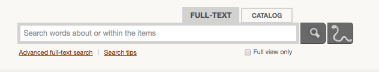
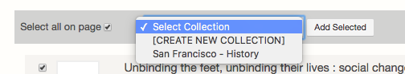
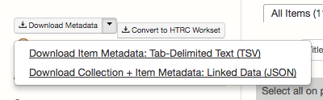

# HathiTrust Research Center (HTRC)

The [HathiTrust Digital Library](https://www.hathitrust.org/) contains over 14 million volumes scanned from academic libraries around the world (primarily in North America). The [HathiTrust Research Center](https://analytics.hathitrust.org/) allows researchers to access almost all of those texts in a few different modes for computational text analysis. 

This notebook will walk us through getting set-up to analyze [HTRC Extracted Features](https://wiki.htrc.illinois.edu/display/COM/Extracted+Features+Dataset) for volumes in HathiTrust in a Jupyter/Python environment. *Extracted Features* are currently (as of April 2017) the most robust way to access in-copyright works from the HT Library for computational analysis. 

For more information on HTRC: 
* [Library text mining guide page on HTRC](http://guides.lib.berkeley.edu/c.php?g=491766&p=3381443)
* [Programming Historian's Text Mining in Python through the HTRC Feature Reader](http://programminghistorian.org/lessons/text-mining-with-extracted-features)

## Installation

To start we'll need to install a few things:
* Install the *HTRC Feature Reader* to work with Extracted Features: 
```
conda install -c htrc htrc-feature-reader
``` 
or
```
pip install htrc-feature-reader
pip install matplotlib jupyter
```
* Install Rsync to download Extracted Features from HathiTrust:

  * For Linux:
```
yum -y install rsync
```
  * For Mac you need to use [Homebrew](https://brew.sh/) to install Rsync. To install Homebrew:
```
/usr/bin/ruby -e "$(curl -fsSL https://raw.githubusercontent.com/Homebrew/install/master/install)"
```
  * And then to install Rsync on Mac using Homebrew:
```
brew tap homebrew/dupes
brew install rsync
```

## Adding volumes from HathiTrust

To build your own corpus, you first need to find the volumes you'd like to include in the [HathiTrust Library](https://www.hathitrust.org/). Alternately, you can access volumes from existing [public HT collections](https://babel.hathitrust.org/cgi/mb?colltype=featured), or use one of the sample datasets included below under the *Sample datasets* heading. To access extracted features from HathiTrust:

* Install and configure [the HT + HTRC mashup](https://data.analytics.hathitrust.org/features/) browser extension.
* Once the extension is running, go to the [HathiTrust Library](https://www.hathitrust.org/), and search for the titles you want to include.
* You can manually download extracted features one result at a time by simply choosing the *Download Extracted Features* link for any item in your search results. Save the .json.bz2 file or files and skip to the next section, *Working with Extracted Features* below to load them into your workspace.
* If you plan to work with a large number of texts, you might choose instead to create a collection in HathiTrust, and then download the Extracted Features for the entire collection at once. This requires a valid CalNet ID. 

### To create a collection:

* [Login to HathiTrust](https://www.hathitrust.org/shibboleth)
* Change the HathiTrust search tab to *Full-Text* or go to the [Advanced Full-Text search](https://babel.hathitrust.org/cgi/ls?a=page;page=advanced).



* Check the boxes to the left of any search results you want to add to your collection (or select all), and use the *Select Collection* dropdown to *Add Selected* volumes to collections of your own design.



* Choose *My Collections* from the top of the HathiTrust interface, choose your collection, and from the *Download Metadata* button/dropdown choose the TSV option.



* Open the TSV file, and then delete all of the columns except for the first column, *htitem_id.* Delete the *htitem_id* header row as well and then save the file to your working directory.
